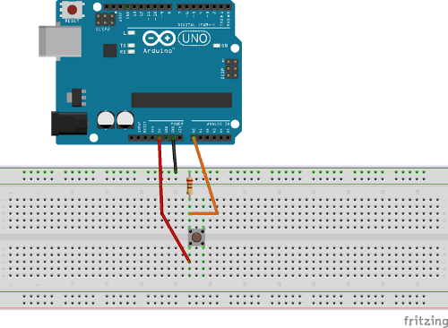

# Arduino
This files are useful to connect *Arduino*'s **serial communication** to the internet!

# How it works
Arduino sends a simple command throgh **serial port** then the *pyscript* act as server for services like [IFTTT](https://ifttt.com/) or [Telegram](https://telegram.org/)

# Services
## IFTTT
You may want to register a **IFTTT** account at https://ifttt.com/join

On IFTTT you must activate *Maker* and *iOS Notification* (or similar) channels. When *Maker* is active you have a *key*!

When IFTTT is active you have to create a **receipe** similar to [the one I already created](https://ifttt.com/recipes/459425-arduino-send-notification)

## Telegram
You have to create a **bot**, more documentation at https://core.telegram.org/bots

The simplest process is:
* add [@BotFather](https://telegram.me/botfather)
* write him `/newbot` and follow the instruction
* get the *API key*

# Script
Now connect **Arduino** to a USB port of your computer, open *IDE* and get the name of **serial port** (something like */dev/tty.usbmodem314*)

Clone this repo `git clone https://github.com/fvalle1/Arduino_serial`

open *pyscript.py* write your **correct keys** and change the messages!

# Run
Complete the [easy **circuit** at top of this page](scheme.png), **load** *Arduino.ino* to your board and finally 
*run* `python pyscript.py`

# Advanced
*telegram.py* is a simple script the replies to a message in telegram as an *echo*

if you write him '*dimmi qualcosa*' it will send to telegram the read of the serial port

# License
Copyright (C) 2016  fvalle1

This program is free software: you can redistribute it and/or modify
it under the terms of the GNU General Public License as published by
the Free Software Foundation, either version 3 of the License, or
(at your option) any later version.

This program is distributed in the hope that it will be useful,
but WITHOUT ANY WARRANTY; without even the implied warranty of
MERCHANTABILITY or FITNESS FOR A PARTICULAR PURPOSE.  See the
GNU General Public License for more details.

More details at [LICENSE](LICENSE)
